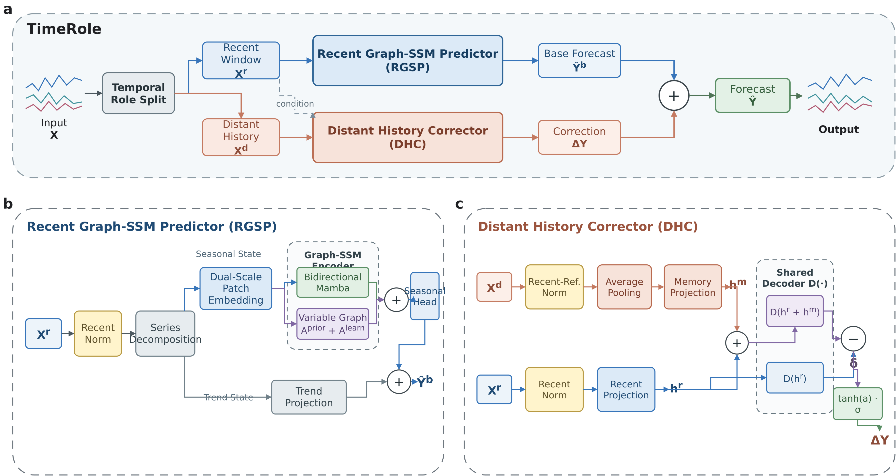

# TimeRole：面向多变量长期时间序列预测的历史职责分化建模

*TimeRole: Role-differentiated historical modeling for multivariate long-term time-series forecasting*

## 摘要

扩大回溯范围能够为多变量长期预测提供更早的状态信息，但将全部历史以相同分辨率送入统一预测主干，容易同时增加冗余、状态失配和计算成本。现有方法主要改进长序列编码或多尺度表示，对不同时间范围在最终输出中应承担的异质职责关注不足。本文认为，历史观测距预测起点的位置不仅应决定其表示分辨率，还应决定其预测职责，并据此提出 TimeRole。该模型由图增强状态空间近期预测器（RGSP）和远期历史修正器（DHC）组成：RGSP 保留近期窗口的原始分辨率并生成完整基础预测；DHC 压缩远期历史，通过共享解码器的配对输出差值与变量级注入系数形成条件修正。由此，模型可访问的历史范围与高成本预测主干的直接输入长度得以分离。在多个公开基准和不同预测跨度上的实验表明，TimeRole 在两项误差指标上均保持了稳定且具有竞争力的总体性能。共享 RGSP 的严格对照显示，DHC 在不同数据集、预测跨度和随机种子下均带来一致改善；冻结历史干预进一步表明，这些增益依赖与当前样本匹配的远期内容。将 DHC 接入 TimeXer 后仍能获得稳定的平均误差改善，说明历史职责分化可以适配不同的近期预测主干。资源测量同时表明，压缩修正路径能够减少直接长输入所需的参数量和显存。上述结果支持历史职责分化作为规则采样多变量长期预测中一种兼顾历史覆盖、预测精度与计算成本的建模方式。

**关键词：** 多变量时间序列预测；长期预测；长上下文；历史压缩；非对称历史建模

## 1 引言

多变量长期时间序列预测旨在根据多通道历史观测估计较长预测区间内的未来变化，是能源调度、气象监测、交通管理和工业运维等应用的重要基础。延长回溯窗口是一种直观的信息扩展方式，因为更早的观测可能揭示长周期模式和缓慢的状态迁移。然而，额外历史并不总能转化为预测收益：随着观测远离预测起点，其信息可能逐渐冗余、受到噪声干扰或与当前状态失配，同时还会增加表示与计算负担。已有最大有效窗口（Maximum Effective Window，MEW）研究也在所评估的 Transformer 类预测器中观察到长窗口利用的饱和现象 [@Zhang2025MEW]。这表明，长上下文预测的核心问题不仅在于模型能够读取多长的历史，还在于不同时间范围的观测应以何种方式参与预测。

现有方法主要从两个方向改善这一问题。第一类工作增强统一预测主干，通过稀疏或自相关注意力、patch 与变量 token、二维变化、多尺度混合及选择性状态空间扫描，提高长序列的表示能力或计算效率 [@Zhou2021Informer; @Wu2021Autoformer; @Nie2023PatchTST; @Liu2024iTransformer; @Wu2023TimesNet; @Wang2024TimeMixer; @Wang2025SMamba; @Gu2024Mamba]。第二类工作重组长上下文内部的信息路径：MEW 工作对长输入进行筛选和选择性遗忘，MPGTimer 在统一框架内联合学习多尺度 patch 与图增强变量交互，Attraos 则以多分辨率动态记忆保存历史动力结构 [@Zhang2025MEW; @Duan2026MPGTimer; @Hu2024Attraos]。这些方法分别推进了长序列的表示、过滤和记忆，但对近期与远期观测在最终预测中的异质职责仍缺乏明确建模。

本文从历史信息的职责分化出发。近期窗口最接近预测起点，适合保留原始分辨率并形成基础预测；更早历史可能保留长周期和缓慢变化信息，适合根据当前状态对基础预测进行条件修正。这一视角将“模型可访问的历史范围”与“主预测器直接处理的序列长度”解耦，使远期信息能够以受控方式参与预测。

基于这一思路，本文构建 TimeRole，由高分辨率近期状态路径和低分辨率远期修正路径组成。近期路径采用图增强状态空间预测器联合建模预测起点附近的时间动态与变量关系，并生成基础预测。远期路径将更早观测压缩为历史修正表示，通过共享解码器的配对输出差值识别远期历史引起的边际预测变化，再由有界通道系数注入基础预测。因此，TimeRole 将当前状态估计与历史条件校正组织为功能互补的两条路径。该设计以现有图学习和选择性状态空间建模为近期预测基础 [@Liu2022TPGNN; @Huang2023CrossGNN; @Wang2025SMamba; @Chen2026GMamba; @Zhou2026SSMGNN]，并将核心创新聚焦于不同时间范围的预测职责分配。

本文的贡献如下：

1. 提出 TimeRole 及其近期—远期历史职责分化原则，将高分辨率基础预测与低分辨率历史修正分离，使扩展可访问历史不再要求同步扩大主预测器的直接输入长度。
2. 在 TimeRole 中设计与近期预测器功能互补的压缩历史修正分支，以远期历史压缩、近期条件下的配对解码差值和有界通道注入构成完整修正路径；该设计限制远期路径只表达相对于同一近期输入的边际变化，而不重复承担完整预测任务。
3. 通过统一基线比较、多随机种子对照、历史干预和跨主干迁移实验验证 TimeRole。结果表明，该模型能够以接近近期预测器的资源开销稳定利用样本匹配的远期历史，并在预测精度与计算成本之间取得有竞争力的平衡。

## 2 相关工作

### 2.1 多变量长期预测骨干与图—状态空间建模

多变量长期预测骨干需要同时处理时间依赖、变量交互和输入长度带来的计算负担。基于注意力的 Informer 以稀疏交互降低复杂度，Autoformer 通过分解和自相关建模周期依赖 [@Zhou2021Informer; @Wu2021Autoformer]。后续工作通过改变 token 或表示域减少冗余：PatchTST 将局部时间片段编码为 token，iTransformer 将变量视为 token，TimesNet 将一维序列映射为二维周期变化，TimeMixer 则在多个采样尺度间分解和混合信息 [@Nie2023PatchTST; @Liu2024iTransformer; @Wu2023TimesNet; @Wang2024TimeMixer]。这些方法虽然结构不同，但都主要回答同一个问题：如何使一个预测主干更有效地编码给定输入。

变量关系建模形成了与时间主干互补的技术路线。TPGNN 以时间多项式图描述动态变量相关性，CrossGNN 通过跨尺度图和跨变量图处理噪声与异质交互，DiM 则将差分—倒置时间嵌入与多头图学习组合起来 [@Liu2022TPGNN; @Huang2023CrossGNN; @Mo2026DiM]。与此同时，S-Mamba 将选择性状态空间模型引入多变量预测；更直接地，G-Mamba 通过图条件化的状态更新结合静态拓扑和动态邻接，SSMGNN 则在谱图域中引入状态空间滤波 [@Wang2025SMamba; @Chen2026GMamba; @Zhou2026SSMGNN]。这些工作为 TimeRole 的近期预测路径提供了建模基础。在本文的非对称架构中，状态空间扫描描述预测起点附近的时间演化，图传播则刻画同期变量依赖。在此基础上，TimeRole 进一步探索如何在不扩展高分辨率近期路径的情况下，以专门的修正职责引入更早历史。

### 2.2 长上下文选择、压缩与结构化记忆

一类长上下文方法关注输入选择与有效窗口。MEW 将“继续增加回溯长度但性能不再改善”的临界点形式化，并通过信息瓶颈过滤器提取关键子序列、通过 Transformer–Mamba 混合模块对长序列执行选择性遗忘 [@Zhang2025MEW]。这一路线说明，更长输入中同时存在信息与干扰，模型需要决定保留什么。压缩历史修正分支不在远期历史内部显式选择关键子序列，而是先固定近期基础预测，再限制远期压缩表示只产生相对于该预测状态的条件变化；两者分别解决“保留哪些历史”和“远期历史承担何种预测职责”。

另一类方法通过尺度组织或结构化记忆提高长历史的可用性。TimeMixer 在多个采样尺度间混合分解后的季节与趋势信息；MPGTimer 将多尺度 patch 对齐为统一表示，并以图增强交互注意力联合建模时间层次与变量依赖 [@Wang2024TimeMixer; @Duan2026MPGTimer]。Attraos 基于相空间重构和吸引子不变性，以多分辨率动态记忆保存历史动力结构 [@Hu2024Attraos]。这些工作分别强调跨尺度混合、统一长上下文表示和动力系统记忆。TimeRole 则保留近期预测器的高分辨率路径，并将压缩后的远期记忆组织为配对条件修正，从而形成按时间范围分配职责的长历史建模方式。

信息分工还可以沿时间范围之外的轴建立。Wrinkles in Time 先分解季节项与趋势项，再分别以多尺度二维 patch 和趋势超分辨率分支提取对应模式；DiM 则分别强化时间动态表示和通道关系学习 [@Chen2026Wrinkles; @Mo2026DiM]。这些工作为异质信息采用专门处理路径提供了直接设计先例，但它们按信号成分或表示目标分工。压缩历史修正分支的划分轴是观测距预测起点的时间范围：近期窗口负责生成基础预测，远期历史只能在给定近期状态后提供有界修正。由此，压缩历史修正分支与现有多尺度、记忆和混合骨干的区别不在于是否压缩历史，而在于压缩后的历史是否仍参与完整预测状态的重建。

## 3 方法

### 3.1 问题定义与历史职责划分

给定包含 $N$ 个变量、长度为 $L$ 的历史序列

$$
\mathbf{X}_{t}=[\mathbf{x}_{t-L+1},\ldots,\mathbf{x}_{t}]
\in\mathbb{R}^{L\times N},
$$

多变量长期预测旨在学习映射 $f_{\Theta}$，输出未来 $H$ 个时间点

$$
\widehat{\mathbf{Y}}_{t}=f_{\Theta}(\mathbf{X}_{t})
\in\mathbb{R}^{H\times N}.
$$

本文将输入按时间顺序划分为远期历史与近期窗口：

$$
\mathbf{X}_{t}=[\mathbf{X}^{d}_{t};\mathbf{X}^{r}_{t}],
\quad
\mathbf{X}^{d}_{t}\in\mathbb{R}^{L_d\times N},
\quad
\mathbf{X}^{r}_{t}\in\mathbb{R}^{L_r\times N},
\quad L=L_d+L_r.
$$

TimeRole 不要求两段历史共同重建同一个预测状态，而是依据它们与预测起点的距离分配不同职责：$\mathbf{X}^{r}_{t}$ 保留原始分辨率，用于估计预测起点附近的状态并生成基础预测；$\mathbf{X}^{d}_{t}$ 经过压缩后只估计相对于该近期状态的条件修正。由此，模型能够访问长度为 $L$ 的历史，但高成本的状态空间扫描和变量图传播仅作用于长度为 $L_r$ 的近期窗口。

### 3.2 TimeRole 总体架构

TimeRole 的总体架构如图1所示，前向过程由四个连续阶段组成：

1. **输入划分与统一参照。** 将输入划分为远期历史和近期窗口，并以近期窗口的统计量建立两段历史共享的归一化参照。
2. **近期基础预测。** 图增强状态空间近期预测器对近期窗口执行序列分解、双尺度时间编码和变量图传播，输出基础预测 $\widehat{\mathbf{Y}}^{b}_{t}$。
3. **远期条件修正。** 压缩历史修正分支对远期历史进行低分辨率汇聚，在相同近期状态下比较加入历史前后的解码结果，得到边际变化 $\Delta\mathbf{Y}_{t}$。
4. **输出重组。** 通过变量级有界系数调节历史变化，并将其加到基础预测上形成最终输出。

具体而言，模型根据近期窗口计算每个变量的均值与标准差：

$$
\mu_n=\frac{1}{L_r}\sum_{i=1}^{L_r}X^{r}_{i,n},
\qquad
\sigma_n=\sqrt{\frac{1}{L_r}\sum_{i=1}^{L_r}(X^{r}_{i,n}-\mu_n)^2+\epsilon}.
$$

两段历史均采用上述近期统计量进行归一化：

$$
\widetilde{\mathbf{X}}^{r}_{:,n}
=\frac{\mathbf{X}^{r}_{:,n}-\mu_n}{\sigma_n},
\qquad
\widetilde{\mathbf{X}}^{d}_{:,n}
=\frac{\mathbf{X}^{d}_{:,n}-\mu_n}{\sigma_n}.
$$

归一化统计量在前向传播中停止梯度。由于近期窗口与远期历史使用相同的参考系，$\widetilde{\mathbf{X}}^{d}$ 表示远期观测相对于当前局部水平和波动的偏移。图增强状态空间近期预测器仅接收 $\mathbf{X}^{r}_{t}$，压缩历史修正分支则接收 $\widetilde{\mathbf{X}}^{r}_{t}$ 与 $\widetilde{\mathbf{X}}^{d}_{t}$。完整映射为

$$
\widehat{\mathbf{Y}}^{b}_{t}=F_{\theta}(\mathbf{X}^{r}_{t}),
\qquad
\widehat{\mathbf{Y}}_{t}=\widehat{\mathbf{Y}}^{b}_{t}+\Delta\mathbf{Y}_{t}.
$$

其中，$F_{\theta}$ 表示图增强状态空间近期预测器，$\widehat{\mathbf{Y}}^{b}_{t}$ 为基础预测，$\Delta\mathbf{Y}_{t}$ 为压缩历史修正分支产生的条件修正。两条路径仅在输出层汇合，因此远期历史不会进入近期预测器的状态空间扫描和变量图传播过程。

**图1 TimeRole 的历史职责分化框架。** **a** 总体流程将输入划分为远期历史 $\mathbf{X}^{d}_{t}$ 与近期窗口 $\mathbf{X}^{r}_{t}$；近期图状态空间预测器（RGSP）生成基础预测 $\widehat{\mathbf{Y}}^{b}_{t}$，远期历史修正器（DHC）生成条件修正 $\Delta\mathbf{Y}_{t}$，二者相加得到最终预测 $\widehat{\mathbf{Y}}_{t}$。**b** RGSP 对近期窗口执行归一化和序列分解，在粗、细两个 patch 网格上分别进行参数共享的双向 Mamba 编码，并结合变量图传播重组季节与趋势输出。**c** DHC 使用近期统计量归一化并压缩远期历史，在相同近期状态下通过共享解码器计算加入历史前后的配对差值，再经有界变量系数得到条件修正。

### 3.3 高分辨率近期状态编码器：图增强状态空间近期预测器

图增强状态空间近期预测器负责从最接近预测起点的观测中形成完整基础预测。该路径保留近期窗口的原始分辨率，并依次执行序列分解与双尺度表示、双向状态空间编码、变量图传播和预测重建。

#### 3.3.1 近期分解与双尺度表示

近期窗口同时包含平滑变化和局部波动。模型首先对归一化近期序列执行移动平均分解：

$$
\mathbf{T}^{r}=\operatorname{MA}(\widetilde{\mathbf{X}}^{r};w),
\qquad
\mathbf{S}^{r}=\widetilde{\mathbf{X}}^{r}-\mathbf{T}^{r},
$$

其中，$w$ 为移动平均窗口，$\mathbf{T}^{r}$ 与 $\mathbf{S}^{r}$ 分别表示趋势项和季节项。趋势项沿时间维通过线性映射直接外推：

$$
\widehat{\mathbf{Y}}^{\mathrm{tr}}_{:,n}
=\mathbf{W}_{\mathrm{tr}}\mathbf{T}^{r}_{:,n}.
$$

季节项在两个时间尺度上构造 patch。设尺度 $s$ 的 patch 长度和步长分别为 $p_s$ 与 $q_s$。模型首先在序列右端复制 $q_s$ 个边界值，再以步长 $q_s$ 提取长度为 $p_s$ 的窗口，因此该尺度包含

$$
J_s=\left\lfloor\frac{L_r+q_s-p_s}{q_s}\right\rfloor+1
$$

个 patch。记第 $j$ 个 patch 覆盖的时间索引为 $\mathcal{I}^{(s)}_j$，则第 $n$ 个变量对应的 patch token 为

$$
\mathbf{z}^{(s)}_{n,j}
=\mathbf{W}^{(s)}_{p}\mathbf{S}^{r}_{\mathcal{I}^{(s)}_j,n}
+\mathbf{e}^{(s)}_{j}+\mathbf{v}_{n},
\qquad
\mathbf{z}^{(s)}_{n,j}\in\mathbb{R}^{d},
$$

其中，$\mathbf{e}^{(s)}_{j}$ 为正弦位置编码，$\mathbf{v}_{n}$ 为跨尺度共享的变量嵌入。本文采用粗、细两个不同粒度的 patch 网格，分别记为 $(p_1,q_1)$ 与 $(p_2,q_2)$，并满足 $p_1>p_2$、$q_1>q_2$。粗粒度网格在相邻 token 之间保留较大的时间覆盖，细粒度网格以更密集的采样表征局部变化。两个网格覆盖相同的近期窗口，但不会被解释为一条连续序列；后续编码在共享参数的条件下分别执行，以避免一个尺度的扫描状态延续到另一个尺度。具体网格设置在第4.1节给出。

#### 3.3.2 参数共享的双向状态空间编码

两个尺度使用同一组双向 Mamba 编码器参数，但分别执行前向计算，因此一个尺度的扫描状态不会延续到另一个尺度。令 $\mathbf{Z}^{(s,\ell)}$ 为尺度 $s$ 在第 $\ell$ 层的输入，忽略 dropout 记号时，该层可表示为

$$
\mathbf{Q}^{(s,\ell)}
=\mathbf{Z}^{(s,\ell)}
+\operatorname{Mamba}_{\rightarrow}
\!\left(\operatorname{LN}(\mathbf{Z}^{(s,\ell)})\right)
+\operatorname{Rev}\!\left[
\operatorname{Mamba}_{\leftarrow}
\!\left(\operatorname{Rev}
\!\left[\operatorname{LN}(\mathbf{Z}^{(s,\ell)})\right]\right)
\right],
$$

$$
\mathbf{Z}^{(s,\ell+1)}
=\mathbf{Q}^{(s,\ell)}
+\operatorname{FFN}\!\left(\operatorname{LN}(\mathbf{Q}^{(s,\ell)})\right),
\qquad
\mathbf{U}^{(s)}=\operatorname{LN}(\mathbf{Z}^{(s,E)}),
$$

其中，$E$ 为编码层数，$\operatorname{Rev}(\cdot)$ 表示沿 patch 顺序翻转。该设计在每个尺度内同时聚合正向与反向的 patch 依赖，同时通过参数共享限制双尺度编码的额外开销。

#### 3.3.3 变量图传播与基础预测重建

状态空间编码在每个变量内部沿 patch 序列传播信息，变量间关系则由并行图分支建模。图结构由训练数据先验和端到端学习的全局关系共同表示。静态邻接矩阵 $\mathbf{A}^{\mathrm{st}}$ 仅根据训练区间内变量间的距离相关性计算；每个变量保留相关性最高的 $K_g$ 个邻居及自连接，随后进行行归一化。给定可学习节点嵌入 $\mathbf{E}_{g}$，学习邻接矩阵与融合邻接矩阵分别为

$$
\mathbf{A}^{\mathrm{lrn}}
=\operatorname{softmax}(\mathbf{E}_{g}\mathbf{E}_{g}^{\mathsf T}),
\qquad
\mathbf{A}=\alpha\mathbf{A}^{\mathrm{st}}
+(1-\alpha)\mathbf{A}^{\mathrm{lrn}}.
$$

其中，$\alpha\in[0,1]$ 为训练先验图的权重。$\mathbf{A}^{\mathrm{lrn}}$ 在训练过程中更新，但对所有样本共享，因此本文将其称为“学习图”，不将其表述为样本动态邻接。

在每个 patch 位置，图分支沿变量维传播信息：

$$
\mathbf{G}^{(s)}_{j}
=\operatorname{GELU}
\!\left(\mathbf{A}\overline{\mathbf{Z}}^{(s)}_{j}\mathbf{W}_{\mathrm{in}}\right)
\mathbf{W}_{\mathrm{out}},
\qquad
\mathbf{H}^{(s)}=\mathbf{U}^{(s)}+\mathbf{G}^{(s)}.
$$

其中，$\overline{\mathbf{Z}}^{(s)}_{j}\in\mathbb{R}^{N\times d}$，$\mathbf{W}_{\mathrm{in}}$ 和 $\mathbf{W}_{\mathrm{out}}$ 分别对应图传播前后的特征投影；为简洁起见，式中省略 dropout。主模型采用时间状态与图状态直接相加；带自适应融合门的实现仅作为消融变体，不属于 TimeRole 的默认框架。

两个尺度的融合状态沿 patch 维拼接，在每个变量内展平后映射至预测区间。季节预测、归一化空间内的基础预测及原尺度输出依次为

$$
\widehat{\mathbf{Y}}^{\mathrm{se}}
=\operatorname{Head}
\!\left([\mathbf{H}^{(1)};\mathbf{H}^{(2)}]\right),
$$

$$
\widehat{\mathbf{Y}}^{b,\mathrm{norm}}
=\widehat{\mathbf{Y}}^{\mathrm{se}}
+\widehat{\mathbf{Y}}^{\mathrm{tr}},
\qquad
\widehat{\mathbf{Y}}^{b}_{:,n}
=\sigma_n\widehat{\mathbf{Y}}^{b,\mathrm{norm}}_{:,n}+\mu_n.
$$

上述过程将两个尺度的时间状态与变量图状态映射为近期基础预测，该输出构成完整预测的第一项。

### 3.4 压缩历史修正分支

压缩历史修正分支不从远期历史独立生成第二个完整预测，而是估计远期历史相对于既定近期状态带来的边际输出变化。该限制使远期路径与近期基础预测路径形成职责互补。

#### 3.4.1 历史压缩与条件状态

首先，以宽度和步长均为 $r$ 的不重叠平均池化压缩归一化远期历史：

$$
\mathbf{M}=\operatorname{AvgPool}(\widetilde{\mathbf{X}}^{d};r),
\qquad
\mathbf{M}\in\mathbb{R}^{N\times K_m},
\quad K_m=L_d/r.
$$

对第 $n$ 个变量，近期窗口和压缩历史分别通过无偏置线性层投影至 $d_h$ 维隐空间：

$$
\mathbf{h}^{r}_{n}=\mathbf{W}_{r}\widetilde{\mathbf{x}}^{r}_{n},
\qquad
\mathbf{h}^{m}_{n}=\mathbf{W}_{m}\mathbf{m}_{n}.
$$

其中，$\mathbf{W}_{r}\in\mathbb{R}^{d_h\times L_r}$，$\mathbf{W}_{m}\in\mathbb{R}^{d_h\times K_m}$。$\mathbf{h}^{r}_{n}$ 提供当前近期状态，$\mathbf{h}^{m}_{n}$ 则表示低分辨率远期历史；二者逐变量对应，不在该分支内执行额外的图传播。

#### 3.4.2 配对解码差分与受控注入

为隔离远期历史相对于同一近期状态引起的输出变化，本文定义无偏置共享解码器 $D(\mathbf z)=\mathbf W_d\operatorname{GELU}(\mathbf z)$，其中 $\mathbf{W}_{d}\in\mathbb{R}^{H\times d_h}$，并计算一对输出：

$$
\mathbf{y}^{-m}_{n}=D(\mathbf{h}^{r}_{n}),
\qquad
\mathbf{y}^{+m}_{n}=D(\mathbf{h}^{r}_{n}+\mathbf{h}^{m}_{n}),
$$

$$
\boldsymbol{\delta}_{n}=\mathbf{y}^{+m}_{n}-\mathbf{y}^{-m}_{n}.
$$

$\boldsymbol{\delta}_{n}$ 表示在近期状态保持不变时，加入第 $n$ 个变量的远期历史状态所产生的解码差值。由于两次解码共享近期状态和解码器参数，该差值避免远期路径重新学习一个与基础预测并列的完整输出。

为分别调节各变量的远期贡献，模型为第 $n$ 个变量设置跨样本和预测步共享的可学习标量 $a_n$，并通过双曲正切限制其系数范围：

$$
g_n=\tanh(a_n),\qquad g_n\in(-1,1),
$$

$$
\Delta\mathbf{Y}_{:,n}=g_n\,\sigma_n\,\boldsymbol{\delta}_{n}.
$$

训练过程中，$g_n$ 在区间 $(-1,1)$ 内调节第 $n$ 个变量的远期修正方向及相对强度。该约束限制的是变量级注入系数，而不是对 $\boldsymbol{\delta}_{n}$ 的绝对幅值作硬截断。最终预测为

$$
\widehat{\mathbf{Y}}_{:,n}
=\widehat{\mathbf{Y}}^{b}_{:,n}
+g_n\sigma_n\boldsymbol{\delta}_{n}.
$$

该式完成 TimeRole 的职责重组：近期路径给出完整基础预测，远期路径只改变由配对差分识别出的历史贡献。

### 3.5 联合训练与额外开销

模型以预测与真实序列之间的均方误差训练：

$$
\mathcal{L}_{\mathrm{MSE}}
=\frac{1}{BHN}
\sum_{b=1}^{B}\sum_{h=1}^{H}\sum_{n=1}^{N}
(\widehat{Y}_{b,h,n}-Y_{b,h,n})^2.
$$

其中，$B$ 为批量大小。

压缩历史修正分支的新增参数来自近期投影、记忆投影、共享解码器与 $N$ 个通道系数：

$$
P_{\mathrm{HC}}=d_h(L_r+K_m+H)+N.
$$

除池化外，其主要增量计算量为

$$
\mathcal{O}\!\left(BNL_d+BNd_h(L_r+K_m+2H)\right).
$$

参数量中的解码器只计数一次，因为有历史与无历史两次解码共享 $\mathbf{W}_d$；计算量中的 $2H$ 则对应两次实际解码。由于 $K_m=L_d/r\ll L_d$，远期历史仅经过池化和线性映射，不参与近期预测器中的状态空间扫描与变量图传播。上述复杂度因此表示在近期预测器之外引入压缩历史修正分支所需的增量开销，而不是 TimeRole 的总复杂度。

## 4 实验

### 4.1 实验设置

实验选用 ETTh1、ETTh2、ETTm1、ETTm2 和 Weather 五个多变量长期预测基准，数据统计见表1。所有任务均采用多变量输入—多变量输出设置，统一输入336点，并预测未来 $H\in\{96,192,336,720\}$ 点；TimeRole 将输入划分为最后96点近期窗口和此前240点远期历史。ETT 数据沿用公开时间顺序划分，Weather 按7:1:2划分训练集、验证集和测试集。预测精度使用均方误差（MSE）和平均绝对误差（MAE）评价，二者均为越低越好。

**表1 数据集统计。** 数据点数不含表头；变量数不含时间戳列。

| 数据集  | 变量数 | 数据点数 | 采样频率 | 数据划分      |
| ------- | -----: | -------: | -------- | ------------- |
| ETTh1   |      7 |   17,420 | 1小时    | 官方 ETT 划分 |
| ETTh2   |      7 |   17,420 | 1小时    | 官方 ETT 划分 |
| ETTm1   |      7 |   69,680 | 15分钟   | 官方 ETT 划分 |
| ETTm2   |      7 |   69,680 | 15分钟   | 官方 ETT 划分 |
| Weather |     21 |   52,696 | 10分钟   | 7:1:2         |

主比较包含 DLinear、PatchTST、iTransformer、TimeMixer、TimesNet、S-Mamba 和 MSGNet，覆盖线性、Transformer、多尺度、状态空间和变量图预测路线。主结果、核心对照与跨主干迁移实验共享数据划分、评价脚本和验证集选点规则，并在随机种子 $\{2021,2022,2023\}$ 下独立运行；冻结历史干预与 RGSP 资源测量使用 seed 2021 的已选检查点，作为诊断性证据。除特别说明外，表中报告测试 MSE 与 MAE 的三次运行均值，核心对照和跨主干迁移结果同时给出样本标准差。

TimeRole 使用 Adam 优化器，初始学习率为 $5\times10^{-4}$，批量大小为32，dropout 为0.1，最多训练100轮，并在验证集 MSE 连续6轮未改善时提前停止。实验基于 PyTorch 2.5.1、CUDA 12.1 和单张 NVIDIA GeForce RTX 4090 完成。TimeMixer 的学习率同样由验证集确定：ETTm2、Weather 及 ETTm1 的96步和720步任务使用 $10^{-4}$，其余任务使用 $10^{-2}$；初始 $10^{-2}$ 设置在后两项任务的 seed 2023 运行中出现数值不稳定，因而在不访问测试集的条件下以 $10^{-4}$ 确认验证稳定性并统一重跑三个种子，各三种子单元不混合不同学习率的结果。

### 4.2 总体预测性能

表3汇总了五个数据集、四个预测跨度和八种方法的三随机种子测试均值。在20个数据集—跨度任务中，TimeRole 分别取得11个最低 MSE 和11个最低 MAE，并另获3个和5个次优结果；其 MSE 与 MAE 的任务级平均排名为1.95和1.75，均为所有比较方法中最低。因此，TimeRole 的总体竞争力同时体现在平方误差和绝对误差，而非依赖单一指标的局部优势。

从预测跨度看，TimeRole 在96、192、336和720步任务上分别取得3、3、3和2个最低 MSE，最低 MAE 的分布同样为3、3、3和2个，表明其优势覆盖短、中、长多种预测范围。从数据集看，TimeRole 在 Weather 的全部四个跨度以及 ETTh2 的96—336步上均同时获得最低 MSE 和 MAE；在 ETTh1 的96步和720步上也取得两项指标最优，并在336步获得最低 MAE；在 ETTm1 上，其192步和336步 MSE 最低。这些结果体现了 TimeRole 在不同时间粒度和预测跨度上的适应性。

不同基线在部分数据集上展现出各自的建模优势。DLinear 在 ETTh1 的中等跨度及 ETTm1、ETTm2 的部分任务上表现突出；TimeMixer 在 ETTm1-96 和 ETTm2 的较长跨度上取得更低误差；S-Mamba 则在 ETTh2-720 上获得最佳结果。相应地，TimeRole 在 ETTm2-192 上取得最低 MAE，并在336步和720步 MAE 上保持次优。以每个任务的最优基线为参照，TimeRole 的20任务宏平均 MSE 高0.376%，宏平均 MAE 低0.059%；结合最佳与次优结果数量以及最低平均排名，TimeRole 在统一336点输入协议下呈现出较为均衡的总体预测性能。在此基础上，下一节进一步通过共享近期预测路径的配对实验，分析远期历史修正对预测性能的具体贡献。

**表3 五数据集统一协议下的三随机种子测试 MSE/MAE（均值±样本标准差，越低越好）。** 单元格依次为 MSE 均值±样本标准差 / MAE 均值±样本标准差。两项指标分别排序：最佳结果以粗体表示，次优结果以下划线表示；排名依据未舍入均值计算，显示值统一保留四位小数。

| 数据集  | $H$ |                                             DLinear |                        PatchTST |                                  iTransformer |                                           TimeMixer |                        TimesNet |                                             S-Mamba |                          MSGNet |                                            TimeRole |
| ------- | ----: | --------------------------------------------------: | ------------------------------: | --------------------------------------------: | --------------------------------------------------: | ------------------------------: | --------------------------------------------------: | ------------------------------: | --------------------------------------------------: |
| ETTh1   |    96 |       <u>0.3754±0.0003</u> / <u>0.3991±0.0004</u> | 0.3987±0.0131 / 0.4205±0.0095 |               0.3987±0.0015 / 0.4172±0.0015 |                     0.3890±0.0055 / 0.4077±0.0031 | 0.4373±0.0097 / 0.4497±0.0048 |                     0.3972±0.0009 / 0.4172±0.0009 | 0.4223±0.0035 / 0.4412±0.0035 | **0.3687±0.0004** / **0.3978±0.0002** |
|         |   192 | **0.4083±0.0004** / **0.4189±0.0005** | 0.4623±0.0054 / 0.4611±0.0086 |               0.4420±0.0022 / 0.4457±0.0012 |                     0.4371±0.0201 / 0.4375±0.0115 | 0.4660±0.0235 / 0.4682±0.0164 |                     0.4339±0.0011 / 0.4410±0.0009 | 0.4545±0.0050 / 0.4645±0.0020 |       <u>0.4146±0.0036</u> / <u>0.4256±0.0007</u> |
|         |   336 |    **0.4389±0.0032** / <u>0.4451±0.0037</u> | 0.5278±0.0217 / 0.5027±0.0113 |               0.4639±0.0056 / 0.4621±0.0039 |                     0.4739±0.0533 / 0.4655±0.0292 | 0.5189±0.0303 / 0.5024±0.0183 |                     0.4516±0.0013 / 0.4546±0.0006 | 0.4809±0.0091 / 0.4794±0.0064 |    <u>0.4486±0.0157</u> / **0.4432±0.0039** |
|         |   720 |       <u>0.4715±0.0017</u> / <u>0.4919±0.0016</u> | 0.6574±0.0537 / 0.5708±0.0193 |               0.5059±0.0050 / 0.5075±0.0029 |                     0.7263±0.0319 / 0.5932±0.0114 | 0.5886±0.0324 / 0.5369±0.0158 |                     0.5115±0.0011 / 0.5089±0.0003 | 0.5242±0.0097 / 0.5155±0.0073 | **0.4543±0.0132** / **0.4584±0.0072** |
| ETTh2   |    96 |                     0.3035±0.0044 / 0.3670±0.0041 | 0.3233±0.0060 / 0.3717±0.0044 |               0.3021±0.0017 / 0.3593±0.0019 |       <u>0.2835±0.0025</u> / <u>0.3485±0.0025</u> | 0.3632±0.0094 / 0.4139±0.0073 |                     0.3008±0.0014 / 0.3577±0.0005 | 0.3695±0.0012 / 0.4144±0.0015 | **0.2828±0.0018** / **0.3428±0.0016** |
|         |   192 |                     0.3973±0.0088 / 0.4287±0.0047 | 0.3893±0.0078 / 0.4213±0.0102 |               0.3876±0.0076 / 0.4104±0.0034 |              <u>0.3607±0.0088</u> / 0.3997±0.0060 | 0.4073±0.0114 / 0.4390±0.0036 |               0.3657±0.0061 /<u>0.3980±0.0026</u> | 0.3981±0.0040 / 0.4293±0.0027 | **0.3439±0.0072** / **0.3865±0.0057** |
|         |   336 |                     0.4819±0.0082 / 0.4822±0.0047 | 0.4285±0.0085 / 0.4443±0.0057 |               0.4197±0.0048 / 0.4337±0.0031 |       <u>0.3830±0.0058</u> / <u>0.4163±0.0014</u> | 0.4072±0.0099 / 0.4433±0.0046 |                     0.3935±0.0033 / 0.4201±0.0024 | 0.3997±0.0157 / 0.4368±0.0115 | **0.3752±0.0037** / **0.4130±0.0055** |
|         |   720 |                     0.7513±0.0088 / 0.6154±0.0040 | 0.4626±0.0266 / 0.4751±0.0142 | <u>0.4236±0.0092</u> / <u>0.4472±0.0054</u> |                     0.4255±0.0112 / 0.4508±0.0048 | 0.4259±0.0111 / 0.4555±0.0048 | **0.4185±0.0031** / **0.4453±0.0010** | 0.4443±0.0134 / 0.4638±0.0035 |                     0.4485±0.0279 / 0.4623±0.0149 |
| ETTm1   |    96 |                  0.3003±0.0006 / **0.3444±0.0008** | 0.3172±0.0117 / 0.3663±0.0072 |               0.3048±0.0015 / 0.3583±0.0012 | **0.2919±0.0026** / <u>0.3475±0.0017</u> | 0.3235±0.0092 / 0.3698±0.0054 |                     0.3011±0.0006 / 0.3557±0.0010 | 0.3090±0.0039 / 0.3629±0.0003 | <u>0.2980±0.0026</u> / 0.3517±0.0026 |
|         |   192 |    <u>0.3344±0.0002</u> / **0.3644±0.0003** | 0.3518±0.0084 / 0.3860±0.0020 |               0.3440±0.0028 / 0.3815±0.0015 |                     0.3386±0.0037 / 0.3746±0.0027 | 0.3817±0.0177 / 0.3987±0.0094 |                     0.3442±0.0002 / 0.3825±0.0004 | 0.3558±0.0059 / 0.3926±0.0044 |    **0.3331±0.0013** / <u>0.3741±0.0005</u> |
|         |   336 |    <u>0.3699±0.0011</u> / **0.3867±0.0020** | 0.3947±0.0165 / 0.4177±0.0091 |               0.3796±0.0016 / 0.4030±0.0012 |                     0.4045±0.0402 / 0.4152±0.0246 | 0.4006±0.0185 / 0.4143±0.0082 |                     0.3775±0.0006 / 0.4027±0.0008 | 0.3890±0.0024 / 0.4119±0.0027 |    **0.3684±0.0019** / <u>0.3947±0.0011</u> |
|         |   720 | **0.4260±0.0023** / **0.4224±0.0035** | 0.4506±0.0201 / 0.4515±0.0158 |               0.4399±0.0049 / 0.4371±0.0025 | <u>0.4279±0.0026</u> / <u>0.4258±0.0013</u> | 0.4779±0.0044 / 0.4592±0.0043 |                     0.4357±0.0009 / 0.4374±0.0006 | 0.4438±0.0111 / 0.4475±0.0068 |                         0.4286±0.0044 / 0.4286±0.0022 |
| ETTm2   |    96 | **0.1670±0.0016** / **0.2619±0.0028** | 0.1819±0.0014 / 0.2716±0.0012 |               0.1746±0.0043 / 0.2655±0.0029 |       <u>0.1728±0.0018</u> / <u>0.2619±0.0021</u> | 0.1974±0.0024 / 0.2787±0.0016 |                     0.1788±0.0014 / 0.2701±0.0015 | 0.1878±0.0015 / 0.2728±0.0020 |                     0.1757±0.0037 / 0.2641±0.0031 |
|         |   192 |           **0.2293±0.0047** / 0.3090±0.0061 | 0.2363±0.0023 / 0.3089±0.0034 |               0.2427±0.0045 / 0.3121±0.0026 |       <u>0.2301±0.0027</u> / <u>0.3010±0.0026</u> | 0.2400±0.0069 / 0.3111±0.0042 |                     0.2366±0.0040 / 0.3101±0.0037 | 0.2419±0.0019 / 0.3111±0.0007 |            0.2308±0.0090 /**0.3000±0.0078** |
|         |   336 |                     0.3022±0.0155 / 0.3632±0.0147 | 0.3084±0.0246 / 0.3571±0.0152 |               0.2988±0.0027 / 0.3477±0.0014 | **0.2804±0.0036** / **0.3349±0.0034** | 0.3022±0.0049 / 0.3512±0.0023 |              <u>0.2838±0.0018</u> / 0.3392±0.0004 | 0.3017±0.0094 / 0.3493±0.0062 |               0.2852±0.0054 /<u>0.3358±0.0046</u> |
|         |   720 |                     0.4214±0.0098 / 0.4391±0.0085 | 0.3954±0.0110 / 0.4076±0.0072 |               0.3770±0.0028 / 0.3948±0.0015 | **0.3637±0.0036** / **0.3871±0.0008** | 0.4363±0.0575 / 0.4212±0.0258 |              <u>0.3747±0.0014</u> / 0.3942±0.0013 | 0.4017±0.0102 / 0.4055±0.0045 |               0.3755±0.0007 /<u>0.3917±0.0027</u> |
| Weather |    96 |                     0.1749±0.0005 / 0.2366±0.0012 | 0.1560±0.0021 / 0.2056±0.0031 |               0.1630±0.0012 / 0.2124±0.0009 |       <u>0.1478±0.0004</u> / <u>0.1976±0.0002</u> | 0.1663±0.0016 / 0.2249±0.0026 |                     0.1567±0.0014 / 0.2065±0.0008 | 0.1616±0.0011 / 0.2179±0.0020 | **0.1461±0.0006** / **0.1965±0.0011** |
|         |   192 |                     0.2157±0.0007 / 0.2736±0.0019 | 0.2009±0.0021 / 0.2466±0.0013 |               0.2046±0.0036 / 0.2504±0.0026 |       <u>0.1918±0.0029</u> / <u>0.2407±0.0029</u> | 0.2146±0.0040 / 0.2655±0.0016 |                     0.2045±0.0039 / 0.2518±0.0056 | 0.2113±0.0036 / 0.2599±0.0008 | **0.1880±0.0004** / **0.2369±0.0012** |
|         |   336 |                     0.2624±0.0015 / 0.3137±0.0029 | 0.2565±0.0031 / 0.2903±0.0028 |               0.2565±0.0023 / 0.2898±0.0020 |       <u>0.2424±0.0009</u> / <u>0.2809±0.0009</u> | 0.2724±0.0069 / 0.3068±0.0048 |                     0.2555±0.0027 / 0.2879±0.0017 | 0.2610±0.0046 / 0.2945±0.0030 | **0.2416±0.0004** / **0.2776±0.0005** |
|         |   720 |                     0.3258±0.0022 / 0.3664±0.0036 | 0.3302±0.0015 / 0.3404±0.0011 |               0.3307±0.0043 / 0.3397±0.0023 |       <u>0.3187±0.0016</u> / <u>0.3334±0.0016</u> | 0.3480±0.0016 / 0.3550±0.0021 |                     0.3258±0.0036 / 0.3387±0.0022 | 0.3696±0.0169 / 0.3624±0.0081 | **0.3177±0.0004** / **0.3315±0.0003** |

### 4.3 历史职责分化的贡献归因

为识别总体性能提升中由远期历史修正带来的增益，表4在相同近期预测路径下比较 TimeRole 与内部变体 RGSP-96。RGSP-96 仅保留 RGSP 并输入最后96点，不包含远期历史修正器；完整模型采用相同的近期主干、优化设置和检查点选择规则，并额外压缩此前240点远期历史以生成条件修正。因此，该配对对照的唯一结构差异是是否引入远期历史修正。

**表4 TimeRole 与 RGSP-96 的三随机种子测试结果（均值±样本标准差，越低越好）。** 完整模型置于首位；最佳结果以粗体表示，次优结果以下划线表示。

| 数据集 | $H$ | 方法 | MSE | MAE | 改善（MSE/MAE） |
| ------ | --: | ---- | --: | --: | -------------: |
| ETTm1 | 96 | TimeRole | **0.298±0.003** | **0.352±0.003** | 10.466% / 5.203% |
| | | RGSP-96 | <u>0.333±0.003</u> | <u>0.371±0.003</u> | — |
| | 192 | TimeRole | **0.333±0.001** | **0.374±0.001** | 10.165% / 4.934% |
| | | RGSP-96 | <u>0.371±0.004</u> | <u>0.393±0.002</u> | — |
| | 336 | TimeRole | **0.368±0.002** | **0.395±0.001** | 7.280% / 4.399% |
| | | RGSP-96 | <u>0.397±0.006</u> | <u>0.413±0.003</u> | — |
| | 720 | TimeRole | **0.429±0.004** | **0.429±0.002** | 6.884% / 4.551% |
| | | RGSP-96 | <u>0.460±0.003</u> | <u>0.449±0.002</u> | — |
| ETTm2 | 96 | TimeRole | **0.176±0.004** | **0.264±0.003** | 8.074% / 2.824% |
| | | RGSP-96 | <u>0.191±0.010</u> | <u>0.272±0.007</u> | — |
| | 192 | TimeRole | **0.231±0.009** | **0.300±0.008** | 12.824% / 4.415% |
| | | RGSP-96 | <u>0.265±0.035</u> | <u>0.314±0.018</u> | — |
| | 336 | TimeRole | **0.285±0.005** | **0.336±0.005** | 7.063% / 2.915% |
| | | RGSP-96 | <u>0.307±0.003</u> | <u>0.346±0.003</u> | — |
| | 720 | TimeRole | **0.375±0.001** | **0.392±0.003** | 8.701% / 4.203% |
| | | RGSP-96 | <u>0.411±0.009</u> | <u>0.409±0.007</u> | — |

如表4所示，TimeRole 在 ETTm1 和 ETTm2 的八个任务上均同时降低了平均 MSE 与 MAE。相对 RGSP-96，其 MSE 改善范围为6.884%–12.824%，任务级宏平均改善为8.828%；MAE 改善范围为2.824%–5.203%，宏平均改善为4.162%。进一步展开到三次独立运行形成的24组逐种子配对，TimeRole 在 MSE 和 MAE 上均取得24/24胜。改善覆盖96、192、336和720四种预测长度，表明远期历史修正对不同预测跨度均能形成一致的增量收益。

上述结果将 TimeRole 总体性能中的部分收益归因于远期历史分支：当近期预测器及训练协议保持一致时，引入压缩远期历史能够持续改善基础预测。由此，历史职责分化的作用不仅体现在扩大可访问的历史范围，还体现在以条件修正的方式将远期信息补充至近期预测。下一节进一步分析各组成部分的贡献、远期信息的条件化方式以及模型对历史内容的实际使用。

### 4.4 设计与机制分析

本节从系统组件、修正形式、历史内容和职责边界四个层面分析 TimeRole 的设计。系统级组件敏感性通过重新训练删除变体，考察完整模型对各组成部分的响应；DHC 设计选择比较不同的远期条件化与修正方式；远期历史干预固定模型参数，观察预测对历史内容变化的响应；历史范围与压缩敏感性进一步分析不同分辨率分配下的性能变化。四类实验分别刻画组件贡献、结构选择、输入依赖与配置稳健性，共同补充总体性能和严格对照所提供的证据。

#### 4.4.1 系统级组件敏感性

表5比较完整 TimeRole 与五种删除变体。RGSP-96 移除远期历史修正器；w/o Decomposition、w/o Graph、w/o Mamba 和 w/o Patch 分别关闭 RGSP 中的分解、变量图传播、状态空间编码和 patch 表示。实验覆盖 ETTm1、ETTm2 和 Weather 的四个预测跨度，每种设置均以三个随机种子重新训练。为突出跨任务模式，表中报告各变体相对完整模型的任务级宏平均误差变化，并以完整模型误差更低的任务数作为胜场统计。

**表5 TimeRole 的系统级组件敏感性。** 误差变化为删除对应组件后相对完整模型的任务级宏平均变化（%，正值表示误差增加）；胜场依次为完整模型在 MSE/MAE 上误差更低的任务数。

| 变体 | ETTm1（MSE/MAE） | ETTm2（MSE/MAE） | Weather（MSE/MAE） | 全部（MSE/MAE） | 胜场（MSE/MAE） |
| ---- | ----------------: | ----------------: | ------------------: | --------------: | ---------------: |
| RGSP-96 | +9.562/+5.012 | +10.156/+3.729 | +9.489/+5.503 | +9.736/+4.748 | 12/12 |
| w/o Decomposition | -0.650/-0.901 | +0.014/+0.474 | -0.342/+0.508 | -0.326/+0.027 | 3/7 |
| w/o Graph | -0.324/-0.267 | +1.134/+1.029 | +0.161/+0.173 | +0.324/+0.312 | 7/8 |
| w/o Mamba | -1.841/-1.746 | +0.005/-0.307 | +5.780/+3.543 | +1.315/+0.497 | 6/5 |
| w/o Patch | +1.195/+0.523 | +2.672/+1.375 | -0.457/-0.356 | +1.137/+0.514 | 7/7 |

移除 DHC 后，三个数据集上的宏平均 MSE 均上升9.489%以上，全部12个任务的总体 MSE 和 MAE 分别上升9.736%和4.748%；完整模型在两项指标上均取得12/12胜场。这一跨数据集、跨度和指标一致的变化表明，DHC 是系统级消融中最稳定的增益来源，与第4.3节的近期路径严格对照形成相互补充的证据。

近期路径组件呈现出更具差异性的结果。移除 Graph 和 Patch 后，总体 MSE 分别上升0.324%和1.137%，但完整模型的 MSE 胜场均为7/12，说明两者的收益主要集中于部分数据集和预测跨度。Mamba 的作用随数据特征变化更为明显：Weather 上移除该模块使 MSE 上升5.780%，而 ETTm1 上则下降1.841%。Decomposition 的总体变化接近于零，不同指标与任务之间也未形成一致方向。这些结果显示，近期路径的具体实现存在数据依赖，其中图传播和 patch 表示提供了小幅的总体收益，而分解与状态空间编码仍具有进一步适配或简化的空间。

上述变体均在完整 TimeRole 中与 DHC 联合重新训练，因此表5描述的是系统在组件调整后的整体响应。该结果既突出了远期历史修正的稳定贡献，也为近期路径的结构选择提供了更细致的经验依据。下面进一步考察 DHC 内部的条件化与修正形式。

#### 4.4.2 DHC 设计选择

表6以三个随机种子比较完整 TimeRole 与三种替代实现：Concat 直接拼接近期和历史状态，NoDiff 移除配对输出差分，GlobalGate 以全局系数替代变量级系数。完整 TimeRole 在 ETTm1-96 和 ETTm1-720 上同时取得最低 MSE 与 MAE，并在 ETTm2-720 上取得最低 MAE。按逐种子配对统计，TimeRole 相对 Concat、NoDiff 和 GlobalGate 的 MSE 胜场分别为9/12、9/12和7/12，对应宏平均改善为0.743%、0.912%和0.189%。与此同时，NoDiff 在 ETTm2-96 上取得最低 MSE，GlobalGate 在 ETTm2-720 上取得最低 MSE，表明不同条件化形式在个别任务上各有适配优势。

**表6 TimeRole 设计选择的三随机种子测试 MSE/MAE（均值±样本标准差，越低越好）。** 单元格依次为 MSE / MAE；每个检查点均由验证集 MSE 选择，最佳结果以粗体表示，次优结果以下划线表示，排名依据未舍入均值计算。

| 数据集 | $H$ |               RGSP-96 |                                            TimeRole |                                Concat |                                           NoDiff |                                       GlobalGate |
| ------ | ----: | ------------------------------: | --------------------------------------------------: | ------------------------------------: | -----------------------------------------------: | -----------------------------------------------: |
| ETTm1  |    96 | 0.3328±0.0028 / 0.3710±0.0032 | **0.2980±0.0026** / **0.3517±0.0026** |       0.3026±0.0037 / 0.3536±0.0014 |                  0.3069±0.0040 / 0.3562±0.0011 |    <u>0.3003±0.0029</u> / <u>0.3526±0.0018</u> |
|        |   720 | 0.4603±0.0032 / 0.4490±0.0019 | **0.4286±0.0044** / **0.4286±0.0022** | 0.4336±0.0019 /<u>0.4300±0.0007</u> |                  0.4327±0.0020 / 0.4303±0.0014 |           <u>0.4319±0.0033</u> / 0.4305±0.0009 |
| ETTm2  |    96 | 0.1912±0.0098 / 0.2718±0.0067 |                     0.1757±0.0037 / 0.2641±0.0031 |       0.1758±0.0046 / 0.2646±0.0038 | **0.1752±0.0032** / <u>0.2636±0.0032</u> | <u>0.1752±0.0039</u> / **0.2635±0.0032** |
|        |   720 | 0.4113±0.0090 / 0.4089±0.0069 |    <u>0.3755±0.0007</u> / **0.3917±0.0027** |       0.3766±0.0021 / 0.3934±0.0033 |                  0.3760±0.0011 / 0.3926±0.0025 | **0.3737±0.0004** / <u>0.3922±0.0025</u> |

总体而言，DHC 内部变体之间的差距小于完整模型相对 RGSP-96 的增益。配对差分与变量级修正在四个端点任务上形成了更均衡的 MSE/MAE 组合，而 ETTm2 上的局部差异也说明修正形式可以随序列特征进一步调整。

#### 4.4.3 远期历史干预

在完成重新训练的组件比较后，我们进一步通过冻结检查点考察 DHC 对远期历史内容的响应。实验保持最后96点近期窗口和模型参数不变，仅在推理阶段改变输入 DHC 的前240点历史。样本错配改变远期历史与当前样本的对应关系；时间打乱和时间反转调整历史内部顺序；均值替代和噪声替代移除真实轨迹，同时保持基本数值尺度。表7中的20组干预均使验证 MSE 上升，平均增幅为20.992%。其中，样本错配在全部任务上造成24.05%–75.91%的误差增幅，说明 DHC 能够根据远期历史内容及其与近期窗口的对应关系形成样本相关的预测修正。ETTm2 对时间打乱和反转的响应较小，则进一步显示不同数据集对远期时序顺序的敏感程度存在差异。

**表7 破坏远期历史后验证 MSE 的相对增幅。** 正值表示相对完整历史性能下降；全部结果基于随机种子2021的冻结检查点。

| 数据集 | $H$ | 样本错配 | 时间打乱 | 时间反转 | 均值替代 | 噪声替代 |
| ------ | ----: | -------: | -------: | -------: | -------: | -------: |
| ETTm1  |    96 |  +75.91% |  +25.60% |  +50.87% |  +25.49% |  +26.39% |
|        |   720 |  +24.05% |  +12.29% |  +22.51% |  +13.41% |  +13.72% |
| ETTm2  |    96 |  +34.65% |   +3.13% |   +6.05% |   +4.04% |   +4.16% |
|        |   720 |  +65.48% |   +1.14% |   +1.80% |   +4.54% |   +4.61% |

#### 4.4.4 历史职责边界与压缩敏感性

为考察 TimeRole 在不同历史范围和分辨率分配下的表现，我们分别改变总历史长度、近期窗口长度和 DHC 池化宽度。总历史长度实验覆盖 ETTm1、ETTm2 和 Weather 的96步与720步任务，并在近期窗口固定为96、池化宽度固定为16时，将输入长度设为192、336、720和960。职责边界与压缩实验进一步在 ETTm1 和 ETTm2 上固定总历史为336，分别比较近期窗口48、96和192，以及池化宽度8、16和24。各设置均独立训练三个随机种子，由验证集 MSE 选择检查点，并报告测试集均值；统一主实验采用336点总历史、96点近期窗口和池化宽度16作为基准设置。

扩大总历史范围对长跨度预测表现出更一致的收益。相对336点历史，720点和960点历史在六个数据集—跨度任务上的宏平均测试 MSE 分别降低1.526%和2.093%；在720步预测上，二者的平均降幅进一步达到2.314%和3.566%，其中960点历史在 ETTm1、ETTm2 和 Weather 上均取得更低 MSE。短跨度任务则呈现不同偏好：ETTm1、ETTm2 和 Weather 的最低 MSE 分别出现在336、960和720点。与此同时，各历史长度相对336点的宏平均 MAE 变化均未超过0.622%，表明历史范围扩展对平方误差的影响更为突出。由336点扩展至960点仅使参数量增加不超过0.13%，说明 DHC 可以在不延长近期主干计算序列的情况下扩大远期覆盖范围。

近期窗口长度进一步揭示了高分辨率建模与远期压缩之间的容量取舍。相对96点近期窗口，缩短至48点使四任务宏平均测试 MSE 上升1.254%，同时平均参数量减少48.5%；扩展至192点则使平均参数量增加97.0%，宏平均 MSE 仍上升0.928%。在两个720步任务上，96点近期窗口均取得三种设置中的最低 MSE，而96步预测中 ETTm1 和 ETTm2 分别偏好192点和48点。由此可见，扩大近期高分辨率路径并未形成稳定收益，96点窗口在当前任务中提供了较为均衡的近期状态分辨率与模型容量。

DHC 对所测池化宽度表现出较平稳的响应。相对池化宽度16，宽度8和24的四任务宏平均测试 MSE 仅分别变化+0.301%和+0.070%，宏平均 MAE 变化也均低于0.21%。ETTm1 整体偏好宽度16，而 ETTm2 在部分任务上使用宽度24略优，显示不同序列对远期记忆分辨率具有各自偏好。综合三类因素，336点总历史、96点近期窗口和16点池化宽度在统一协议下形成了稳定的工作点；更长的远期覆盖能够进一步改善长跨度预测，而直接扩大近期窗口会显著增加模型容量。该结果从历史范围与表示分辨率两个角度支持了近期—远期职责分化，并为下一节的跨主干迁移与资源分析提供了依据。

### 4.5 泛化能力与实际代价

前述实验主要围绕 RGSP 与 DHC 构成的完整模型展开。为进一步考察历史职责分化在主干结构变化后的适用性及其资源代价，本节首先将 DHC 接入另一类近期预测主干，随后比较不同历史使用方式的精度与计算开销。

#### 4.5.1 跨预测主干迁移

为考察近期—远期职责分化是否依赖 RGSP 的图与状态空间结构，我们将 DHC 接入 TimeXer。TimeXer 使用 patch 自注意力和变量交叉注意力组织输入，与 RGSP 的建模路径不同。对照模型 TimeXer-336 由原生 TimeXer 直接处理全部336点，TimeXer+DHC 则将最后96点送入 TimeXer 近期路径，并将此前240点压缩为远期条件修正。两种模型访问相同的历史范围，并在相同数据划分、优化设置与验证集选点规则下分别运行三个随机种子，因此该比较同时检验了 DHC 对不同预测主干的适配性以及职责分化相对直接长输入的效果。

表8显示，TimeXer+DHC 在 ETTm1、ETTm2 的96步和720步任务上均取得更低的三随机种子平均 MSE 与 MAE。四个任务的 MSE 降幅为0.82%–3.88%，MAE 降幅为0.33%–1.67%，任务级宏平均降幅分别为2.02%和0.99%；在逐种子比较中，TimeXer+DHC 分别取得10/12个 MSE 胜场和8/12个 MAE 胜场。该结果表明，将远期历史作为条件修正接入注意力式近期主干，可以在不扩大其直接建模序列的情况下形成稳定的任务均值收益。资源诊断还显示，TimeXer+DHC 在四个任务上均使用更少的参数和峰值显存，但批量推理延迟略高，因而其优势主要体现为更紧凑的长历史表示，而非普遍的推理加速。

**表8 TimeXer-336 与 TimeXer+DHC 的三随机种子测试结果。** 两种方法均访问336点历史；结果为均值±样本标准差，检查点由验证集 MSE 选择。

| 数据集 | $H$ | 方法 | MSE | MAE | 降幅（MSE/MAE） |
| ------ | ----: | ---- | ----: | ----: | ---------------: |
| ETTm1 | 96 | TimeXer+DHC | **0.298±0.002** | **0.350±0.001** | 3.88% / 1.10% |
| | | TimeXer-336 | 0.310±0.010 | 0.354±0.004 | — |
| | 720 | TimeXer+DHC | **0.431±0.002** | **0.429±0.001** | 0.82% / 0.87% |
| | | TimeXer-336 | 0.435±0.006 | 0.433±0.003 | — |
| ETTm2 | 96 | TimeXer+DHC | **0.165±0.002** | **0.254±0.002** | 2.20% / 0.33% |
| | | TimeXer-336 | 0.169±0.001 | 0.255±0.001 | — |
| | 720 | TimeXer+DHC | **0.375±0.003** | **0.390±0.004** | 1.20% / 1.67% |
| | | TimeXer-336 | 0.380±0.010 | 0.397±0.008 | — |

#### 4.5.2 精度—效率折中

表9比较三种历史使用方式的精度与资源开销。RGSP-96 仅将最后96点送入近期主干；RGSP-336 将完整336点全部交由同类主干处理；TimeRole 保持96点近期主干，并用 DHC 压缩处理此前240点。参数量、推理延迟和峰值显存均在相同硬件、批量大小和检查点评估流程下测量，表中数值为 ETTm1 与 ETTm2 的平均结果。

相对 RGSP-96，TimeRole 的参数量平均增加约0.5%，每批推理延迟增加约9.1%，峰值显存变化低于0.5%，同时在四个任务上获得5.215%的宏平均 MSE 改善。这表明，DHC 能够以有限的附加开销将远期历史引入近期预测过程。

与 RGSP-336 相比，TimeRole 平均减少69.968%的参数量、43.503%的推理延迟和67.735%的峰值显存，四任务宏平均 MSE 高2.046%。RGSP-336 在96步预测上的平均验证 MSE 略低，而 TimeRole 在720步预测上更低，体现出不同跨度下的精度取舍。总体来看，压缩远期历史避免了直接扩展近期主干带来的大部分资源增长，并形成了更均衡的精度—效率关系。

**表9 相同评估设置下的绝对精度与资源成本。** 每个单元为 ETTm1 与 ETTm2 在随机种子2021下的平均值；显存以 MiB 计，延迟为毫秒/批。

| $H$ | 方法     |         验证 MSE | 参数量（M） | 延迟（ms/batch） |  峰值显存（MiB） |
| ----: | -------- | ---------------: | ----------: | ---------------: | ---------------: |
|    96 | RGSP-96 |           0.2666 |       0.997 |  **4.555** | **132.62** |
|       | RGSP-336   | **0.2417** |       3.232 |            8.924 |           411.45 |
|       | TimeRole |           0.2454 |       1.004 |            5.054 |           132.73 |
|   720 | RGSP-96 |           0.6320 |       6.809 |  **4.902** | **158.17** |
|       | RGSP-336   |           0.6114 |      23.571 |            9.328 |           492.35 |
|       | TimeRole | **0.6095** |       6.836 |            5.257 |           158.89 |

### 4.6 讨论

本研究的主要发现是，远期历史无需与近期状态以相同分辨率承担完整预测任务，将其组织为近期状态条件下的修正同样能够产生稳定价值。五数据集主比较为这一设计提供了总体性能参照，而共享 RGSP 的严格对照进一步将增益定位到 DHC；在模型参数保持不变时，远期历史错配或内容替代又持续破坏预测性能。三类证据共同表明，TimeRole 的收益不仅来自增加参数或延长输入，而且与模型对样本匹配远期内容的利用相联系。因此，历史职责分化的关键作用在于：近期窗口确定基础预测状态，远期历史则补充该状态下未被近期观测充分表达的信息。

这一发现进一步说明，长上下文预测的核心不只是选择更长的回溯窗口，还包括决定不同历史范围以何种分辨率和输出职责进入模型。最大有效窗口研究指出，输入长度增加并不必然转化为预测收益；本研究的敏感性结果则显示，扩大远期覆盖对长跨度预测更有帮助，而扩大近期高分辨率窗口并未形成单调收益。与在多个尺度上共同生成预测的多尺度模型以及基础预测后的残差修正方法相比，TimeRole 将两种思路连接在历史位置上：远期观测先被压缩，再只通过条件修正影响近期基础预测。池化宽度变化带来的较小误差波动也表明，对远期轨迹保留适度的低分辨率结构，可能比将其全部送入高成本主干更符合其在当前任务中的信息作用。

各项消融同时区分了职责分化原则与其具体实现。移除 DHC 在所有系统级任务上均造成一致退化，而图传播、patch、序列分解和 Mamba 的影响随数据集与跨度变化；DHC 内部替代形式之间的差距也明显小于完整模型相对 RGSP-96 的增益，且 NoDiff 或 GlobalGate 在 ETTm2 的个别指标上更优。这说明当前证据最直接支持的是“近期基础预测加远期条件修正”的组织方式，而不是 RGSP 每个组件或某一种修正参数化在所有序列上都不可替代。ETTm1 与 ETTm2 对历史顺序、近期窗口和内部修正形式的不同偏好进一步提示，周期结构、状态变化速度和变量关系可能共同决定合适的职责边界与修正形式。

跨主干与资源结果说明了这一组织方式的实际含义。TimeXer+DHC 相对直接处理全部336点的 TimeXer-336，在四个任务上均降低三随机种子平均 MSE 与 MAE，表明远期修正的作用并非 RGSP 特有，也说明直接增加主干输入长度并不必然更有效。对于 RGSP，TimeRole 以接近 RGSP-96 的参数量和显存获得更低误差；相对 RGSP-336，则以略高的四任务宏平均 MSE 换取显著更低的参数量、延迟和显存。与此同时，TimeXer+DHC 的推理延迟并未同步降低，说明职责分化带来的资源收益取决于主干结构与执行方式。因而，该设计更适合被理解为一种可调节的精度—容量折中：在参数量或显存受限、但仍需扩大历史覆盖的场景中，压缩修正路径提供了直接扩展主干之外的选择。

现有实验也界定了该结论的适用范围。总体比较覆盖五个规则采样数据集，但组件、敏感性与迁移实验主要集中在 ETTm1、ETTm2 和 Weather，变量规模最高为21；跨主干证据目前仅来自 TimeXer，资源结论也依赖当前硬件、批量大小和实现。模型使用固定的近期—远期边界、平均池化宽度以及跨样本和预测步共享的变量级注入系数，这些统一设置能够形成稳定工作点，但不能针对样本状态动态调整历史分辨率和修正强度。后续研究可据此检验由近期状态驱动的边界选择、数据依赖的历史压缩与动态修正系数，并扩展到高维变量、缺失或不规则采样、分布偏移以及更多预测主干，以确定历史职责分化在更广泛条件下的收益边界。

## 5 结论

本文针对长历史统一高分辨率建模中信息收益与计算开销难以同时控制的问题，提出 TimeRole。该模型按照观测距预测起点的时间位置分配非对称职责：RGSP 保留近期窗口的原始分辨率并生成完整基础预测，DHC 则压缩远期历史，并在近期状态条件下仅估计增量修正。由此，模型可访问的历史范围不再等同于高成本预测主干的直接输入长度，为扩展回溯范围提供了可独立控制的历史表示与计算路径。

在五个公开数据集和四个预测跨度的三随机种子比较中，TimeRole 取得11项最佳 MSE 和11项最佳 MAE，并保持最低的两项指标平均排名。在共享 RGSP 的24个数据集—跨度—种子组合中，加入 DHC 均同时降低 MSE 与 MAE；冻结检查点上的历史干预进一步表明，这些收益依赖与当前样本匹配的远期内容。历史范围敏感性、TimeXer-336 与 TimeXer+DHC 的跨主干对照以及资源测量共同说明，压缩远期修正能够扩大历史覆盖，并在精度、参数量和运行成本之间形成不同于直接长输入的折中。总体而言，当前证据支持历史职责分化作为规则采样多变量长期预测中一种成本受控的长历史建模方式；其向更多数据域和预测主干的扩展，以及由样本状态驱动的自适应职责边界，仍有待进一步研究。
